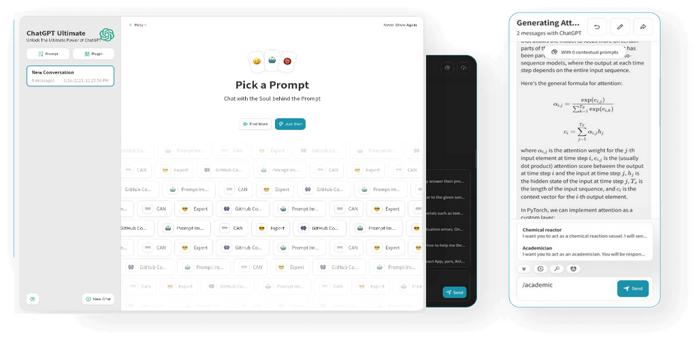

<h1 align="center">The Ultimate ChatGPT 🌟</h1>

The Ultimate ChatGPT es un asistente virtual impulsado por IA diseñado para proporcionar una experiencia mejorada de escritura y resolución de problemas. Con una amplia gama de características y complementos, ofrece respuestas rápidas y precisas a tus consultas. Aquí tienes una descripción general de sus capacidades:

## ✨ Características ✨

### 📝 Asistencia de escritura
The Ultimate ChatGPT puede ayudarte con una variedad de tareas de escritura, incluyendo corrección de pruebas, verificación de gramática y ortografía, y sugerencias para mejorar la claridad y fluidez de tu escritura.

### 💭 Resolución de problemas
The Ultimate ChatGPT puede ayudarte a resolver una variedad de problemas, incluyendo problemas de matemáticas y ciencias, y puede proporcionar orientación y explicaciones paso a paso.

### 🌍 Traducción
The Ultimate ChatGPT puede traducir texto de un idioma a otro, incluyendo del bangla al inglés.

### 📑 Recuperación de información
The Ultimate ChatGPT puede proporcionarte información sobre una variedad de temas, incluyendo eventos actuales, historia, ciencia y más.

### 📚 Personalización
The Ultimate ChatGPT puede aprender de tus interacciones y proporcionar respuestas y sugerencias personalizadas.

### 📎 Integración
The Ultimate ChatGPT puede integrarse con una variedad de otras herramientas y plataformas, incluyendo correo electrónico, aplicaciones de mensajería y más.

### ⌛ Disponibilidad 24/7
The Ultimate ChatGPT está disponible las 24 horas del día, los 7 días de la semana, para brindarte asistencia y soporte siempre que lo necesites.

### 🚀 Respuestas rápidas y precisas
The Ultimate ChatGPT aprovecha el poder del modelo gpt-3.5-turbo y gpt-4 para proporcionar respuestas rápidas y precisas a tus preguntas. Ya sea que necesites información, asistencia o ideas creativas, la IA está diseñada para brindar resultados de alta calidad.

### 💾 Almacenamiento local de datos
Para garantizar la privacidad y la seguridad, The Ultimate ChatGPT almacena todos los datos localmente en tu navegador. Esto significa que tus conversaciones e información permanecen en tu dispositivo, dándote control total sobre tus datos.

### 🔢 Soporte de Markdown
La IA admite Markdown, un lenguaje de marcado ligero, que te permite formatear tu texto fácilmente. Ya sea que desees agregar encabezados, listas o énfasis a tu texto, el soporte de Markdown lo hace simple y conveniente.

### 💡 Prompts personalizados
The Ultimate ChatGPT te permite crear tus propios prompts, lo que te brinda la flexibilidad de adaptar las respuestas de la IA a tus necesidades específicas. Esta función te permite tener una experiencia más personalizada y personalizada.

### 🔆 Complementos
The Ultimate ChatGPT ofrece una variedad de complementos para mejorar tu flujo de trabajo:

- **Complemento de clima**: obtén información meteorológica en tiempo real para cualquier ubicación. Simplemente proporciona el nombre de la ciudad o localidad, y la IA te proporcionará las condiciones meteorológicas actuales.

- **Complemento de Wolfram**: accede al poder del motor de conocimiento computacional Wolfram Alpha. La IA puede ayudarte con cálculos, conversiones y proporcionar respuestas a una amplia gama de preguntas de hechos.

- **Complemento de Zapier**: integra The Ultimate ChatGPT con Zapier, una plataforma de automatización popular. Esto te permite conectar la IA con varias aplicaciones y servicios, lo que permite flujos de trabajo y tareas automatizadas.

### 🔠🈶 Soporte de múltiples idiomas
The Ultimate ChatGPT admite más de 184+ [idiomas](./SUPPORTED_LANGUAGES.md), lo que permite que los usuarios de diferentes regiones interactúen con la IA en su idioma preferido. Esta función hace que la IA sea accesible e inclusiva.

### 💬 Compresión del historial de chat
Para manejar conversaciones largas, The Ultimate ChatGPT comprime el historial de chat, lo que facilita la revisión y navegación. Esta función asegura que la interfaz de chat se mantenga limpia y manejable, incluso durante interacciones prolongadas.

### 📂 Guardar conversaciones
Puedes guardar conversaciones con The Ultimate ChatGPT en varios formatos, incluyendo texto, imagen o en la web. Esta función te permite volver a consultar conversaciones anteriores, compartirlas con otros o almacenarlas para futuras referencias.

### 🔑 Comunidad y soporte activos
The Ultimate ChatGPT cuenta con una comunidad activa de colaboradores que trabajan constantemente para mejorar y mejorar la IA. La comunidad proporciona soporte, comentarios y contribuye al desarrollo de la IA, lo que la convierte en una herramienta en constante evolución y confiable.

### ✳ Aplicación web y repositorio de GitHub
The Ultimate ChatGPT es accesible a través de la aplicación web, que proporciona una interfaz intuitiva y fácil de usar. Además, el repositorio de GitHub de la IA está disponible, lo que permite a los usuarios explorar el código, contribuir y acceder a las últimas actualizaciones.

[![Web][Web-image]][web-url]

[Web App](https://chatgpt.kiask.xyz/) / [Issues](https://github.com/ki-ask/The-Ultimate-ChatGPT/issues)

[web-url]: https://chatgpt.kiask.xyz
   
[download-url]: https://github.com/ki-ask/The-Ultimate-ChatGPT/releases

[Web-image]: https://img.shields.io/badge/Web-PWA-orange?logo=microsoftedge

## ❓ Preguntas frecuentes ❓

¿Qué es The Ultimate ChatGPT?

The Ultimate ChatGPT es un asistente virtual impulsado por IA que proporciona respuestas rápidas y precisas a tus preguntas y ofrece varias características y complementos para mejorar tu escritura y resolución de problemas.

¿Puede The Ultimate ChatGPT almacenar datos localmente?

Sí, The Ultimate ChatGPT puede almacenar todos los datos localmente en tu navegador, lo que garantiza la privacidad y la seguridad.

¿The Ultimate ChatGPT admite Markdown?

Sí, The Ultimate ChatGPT admite Markdown, lo que te permite formatear tu texto y crear contenido enriquecido.

¿Puedo crear mis propios prompts con The Ultimate ChatGPT?

Sí, puedes crear tus propios prompts y personalizar tus interacciones con The Ultimate ChatGPT.

¿Qué complementos están disponibles con The Ultimate ChatGPT?

The Ultimate ChatGPT ofrece complementos como Weather, Wolfram y Zapier para simplificar tu trabajo y proporcionar funcionalidad adicional.

¿The Ultimate ChatGPT admite múltiples idiomas?

Sí, The Ultimate ChatGPT tiene prompts incorporados en múltiples idiomas, lo que te permite comunicarte en tu idioma preferido.

¿Cómo maneja The Ultimate ChatGPT conversaciones largas?

The Ultimate ChatGPT comprime el historial de chat para manejar conversaciones largas de manera eficiente y proporcionar una experiencia fluida.

¿Puedo guardar conversaciones con The Ultimate ChatGPT?

Sí, puedes guardar conversaciones en texto, imagen o en la web utilizando la función de Compartir de KiAsk.

¿Cómo puedo acceder a The Ultimate ChatGPT?

The Ultimate ChatGPT está disponible como una aplicación web, y también puedes acceder al repositorio de GitHub para obtener soporte y características adicionales.

¿The Ultimate ChatGPT está en constante evolución?

Sí, The Ultimate ChatGPT está en constante evolución con actualizaciones y mejoras, y cuenta con una comunidad activa de colaboradores.

## 🎉 Agradecimientos especiales 🎉

### Autores (Agradecimientos especiales a ellos)

[Contributors](https://github.com/Yidadaa/ChatGPT-Next-Web/graphs/contributors)

Espero que esta traducción sea de ayuda. Si tienes alguna otra pregunta, ¡no dudes en preguntar!